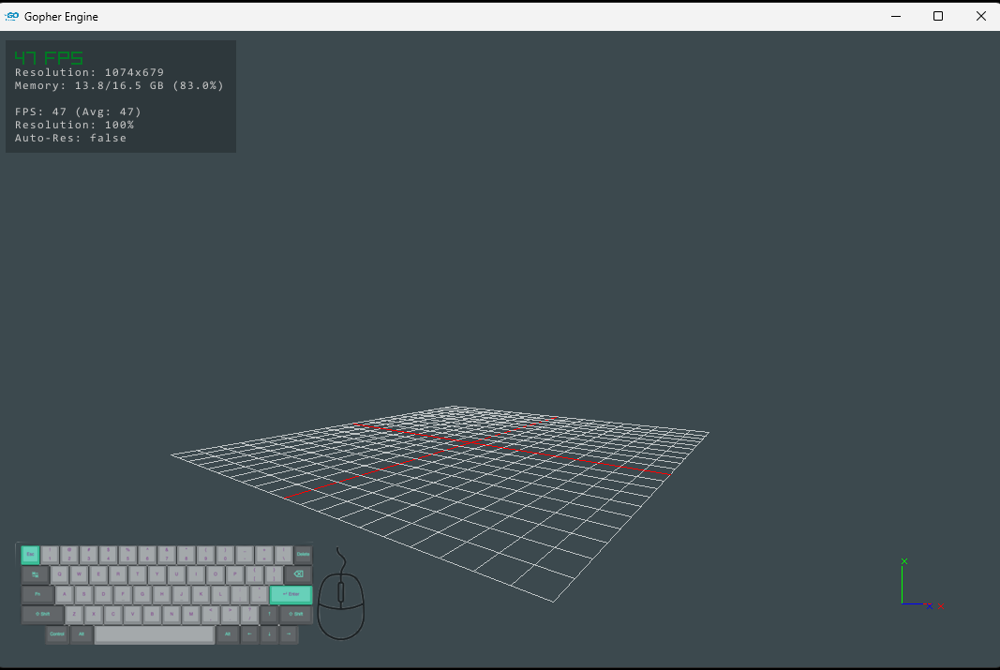
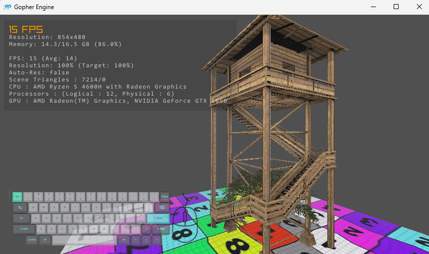
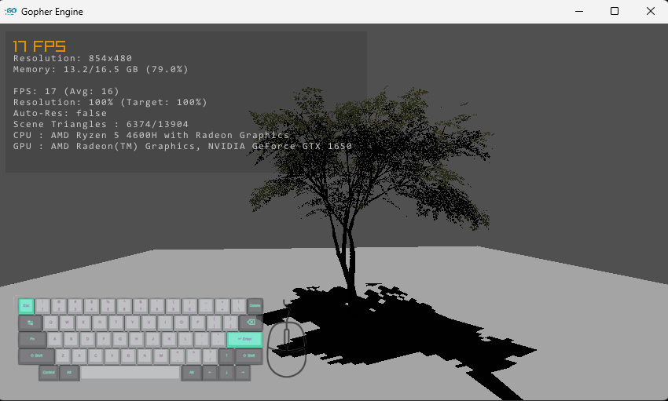

# GopherEngine
A CPU rasterizer using GO language.

# Features
 - Auto Resolution adjustment.
 - Face Culling
 - Bounding Box based Culling
 - Inbuilt OBJ reader
 - Referece Import / Export Support
 - Create compund Asset (Assembly) by combining multiple meshes and export as single asset.
 - Depth Fog
 - Depth Blur
 - Depth Map Shadows
 - Point & directional Lights
 - Blinn-Phong type material with Diffuse, Specular, Normal map support.
 - Raylib Render Window

# Requires (Direct)
- github.com/gen2brain/raylib-go/raylib v0.55.1
- github.com/google/uuid v1.6.0
- github.com/shirou/gopsutil/v4 v4.25.7

# Requires (In-Direct)
- github.com/ebitengine/purego v0.8.4 // indirect
- github.com/go-ole/go-ole v1.2.6 // indirect
- github.com/lufia/plan9stats v0.0.0-20211012122336-39d0f177ccd0 // indirect
- github.com/power-devops/perfstat v0.0.0-20210106213030-5aafc221ea8c // indirect
- github.com/tklauser/go-sysconf v0.3.15 // indirect
- github.com/tklauser/numcpus v0.10.0 // indirect
- github.com/yusufpapurcu/wmi v1.2.4 // indirect
- golang.org/x/exp v0.0.0-20250811191247-51f88131bc50 // indirect
- golang.org/x/sys v0.35.0 // indirect

# How to Run!
After cloing the repository just open terminal from project directory and run "go run main.go"

!

!

!

!
